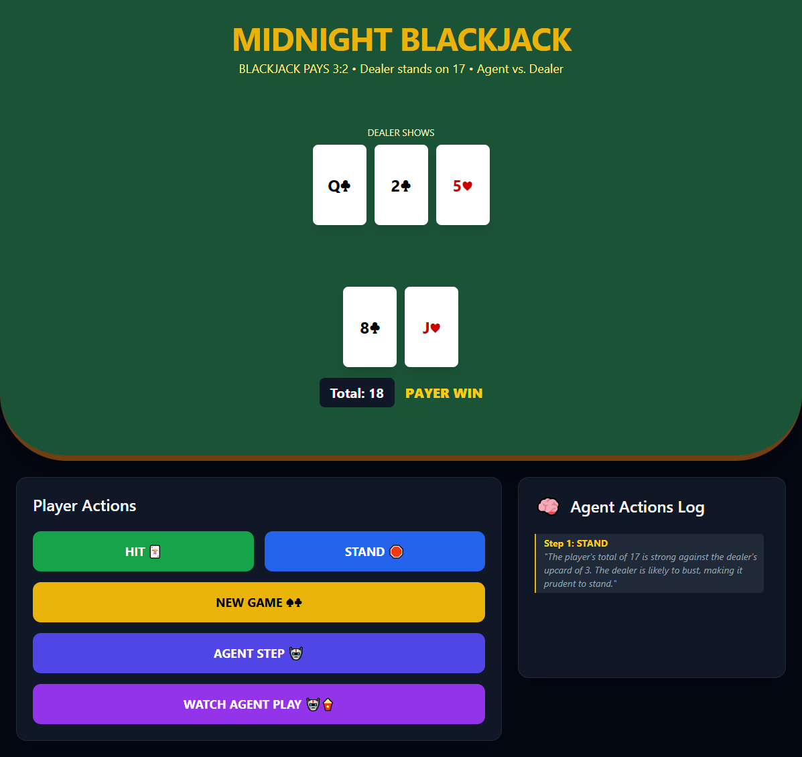

# 🃏 Agentic Blackjack Game (Midnight Edition)

An interactive, web-based Blackjack game where a **GPT-powered Agent** plays against a dealer. This project demonstrates the integration of a **Flask** backend, a custom **Game Engine**, and a **LLM-based decision-making agent** with a real-time "Thought Trace" log.


*(Note: Replace this with the UI image we generated!)*

---

## 🧠 The Agentic Architecture

Unlike a standard game, this project focuses on **Explainable AI (XAI)**. 
1. **The Brain:** Uses GPT-4o (or 3.5) to analyze the current game state.
2. **The Reasoner:** The Agent doesn't just "Hit" or "Stand"—it generates a JSON object containing its mathematical reasoning.
3. **The Trace:** Every move is logged in the "Agent Actions Log," allowing users to see the logic behind every play (e.g., *"Dealer shows 6, I have 12; staying is statistically superior"*).

### Agent Strategy
The Agent is prompted to follow **Blackjack Basic Strategy**:
- **Hard Totals:** Aggressive hitting on < 12, standing on 17+.
- **Soft Totals:** Strategic hitting on Ace-6 or lower.
- **Dealer Upcard:** Adjusts risk based on whether the dealer is in a "Weak" (2-6) or "Strong" (7-A) position.

---

## 🛠️ Tech Stack
- **Frontend:** HTML5, Tailwind CSS, JavaScript (Vanilla).
- **Backend:** Python, Flask.
- **AI/LLM:** OpenAI API (GPT-4o), `python-dotenv`.
- **State Management:** Flask Sessions (Encrypted Cookies).

---

## 🚀 How to Run

### 1. Clone the Repo
```bash
git clone [https://github.com/your-username/agentic-blackjack-game.git](https://github.com/your-username/agentic-blackjack-game.git)
cd agentic-blackjack-game